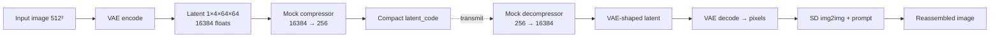

# MORPHOS

**Generative Compression Codec** — RedBot / IMAGE_8 workflow.

Ship a tiny latent vector; reassemble a high-fidelity image with a frozen diffusion prior.

> RedBot research scaffold. Extreme rate reduction via a learned (mock) bottleneck, then generative reconstruction.

Also in this repo: **[Morphogen v2](./morphogen-v2/)** — the living RD audiovisual instrument rebuilt **without WebGL** (CPU Gray–Scott + Canvas 2D). See [MORPHOS and Morphogen](./docs/MORPHOS-AND-MORPHOGEN.md) and the [red-team brief](./docs/morphogen-redteam/MASTER-BRIEF.md).

## Architecture (IMAGE_8)



1. **Encode** — Image → VAE latent `(1, 4, 64, 64)` → mock extreme compression → compact vector (default **256** floats ≈ 1 KB FP32).
2. **Transmit** — Compact numeric code (not an RD / residual-pattern bitstream).
3. **Decode** — Expand vector → VAE-shaped latent → VAE pixels → Stable Diffusion **img2img** (prompt-guided generative reassembly).

### Design notes

| Piece | Status | Notes |
|-------|--------|-------|
| SD 1.5 VAE + UNet | Real (pretrained) | Diffusers `runwayml/stable-diffusion-v1-5` |
| Compression / decompression MLPs | **Untrained mocks** | Shape demo only — train end-to-end in production |
| Decode path | VAE → img2img | Avoids incorrect `latents=` text2img shortcuts |
| Rate–distortion | Illustrative only | `rate_stats()` FP32 + `quantized_rate_stats()` / STE (+ **`LearnedQuantAffine`**) + factorized Laplace + **categorical** `-log2 p(index)` + **tabled rANS** + **self-describing ANS pack**; see [ENTROPY-CODING-NOTES.md](./docs/ENTROPY-CODING-NOTES.md) |
| Bottleneck train sketch | CPU dry-run + STE + learned scales + entropy + categorical + ANS check/pack | [`bottleneck_train_sketch.py`](./bottleneck_train_sketch.py) (`--ste-quant`, `--learned-quant-scales`, `--entropy-rate`, `--categorical-rate`, `--ans-check`, `--ans-pack`) + [docs/TRAINING-SKETCH.md](./docs/TRAINING-SKETCH.md) |

Default illustrative rate at 512²: **256×4 B = 1024 B** → **~0.031 bpp** before generative decode (not a trained RD curve). Uniform 8-bit symbols on the same dim sketch **~0.0078 bpp**. Factorized Laplace (`--entropy-rate`) and categorical-over-STE-indices (`--categorical-rate`) are differentiable rate proxies; `--ans-check` adds a tabled rANS bitstream round-trip under those categorical PMFs, and `--ans-pack` wraps it with frequency side-info so decode needs no live model. `--learned-quant-scales` adapts per-dim STE ranges.

## Quick start (codec)

```bash
python -m venv .venv && source .venv/bin/activate
pip install -r requirements.txt
python generative_codec.py --out-dir ./outputs
# or: ./scripts/run_demo.sh
```

GPU (`cuda`) is strongly preferred. CPU falls back to FP32 and will be slow. First run downloads model weights from Hugging Face.

### Shape-only tests (no model download)

```bash
pip install pytest torch torchvision Pillow requests
PYTHONPATH=. pytest tests/ -q
```

### Bottleneck train sketch (no model download)

```bash
PYTHONPATH=. python bottleneck_train_sketch.py --steps 8
PYTHONPATH=. python bottleneck_train_sketch.py --steps 8 --ste-quant --quant-levels 256
PYTHONPATH=. python bottleneck_train_sketch.py --steps 8 --learned-quant-scales
PYTHONPATH=. python bottleneck_train_sketch.py --steps 8 --entropy-rate
PYTHONPATH=. python bottleneck_train_sketch.py --steps 8 --categorical-rate
PYTHONPATH=. python bottleneck_train_sketch.py --steps 8 --ans-check
PYTHONPATH=. python bottleneck_train_sketch.py --steps 8 --ans-pack
PYTHONPATH=. pytest tests/test_train_sketch.py -q
```

See [docs/TRAINING-SKETCH.md](./docs/TRAINING-SKETCH.md) for the frozen-prior training plan and [docs/ENTROPY-CODING-NOTES.md](./docs/ENTROPY-CODING-NOTES.md) for the rate ladder beyond FP32.

## Morphogen v2 (no WebGL)

```bash
cd morphogen-v2 && npm install && npm run dev
```

Open `http://127.0.0.1:5173` → ENTER → drag to seed colonies. `npm run check:nowebgl` must stay clean.

## CLI (codec)

| Flag | Default | Meaning |
|------|---------|---------|
| `--image` | HF sample URL | Local path or URL |
| `--prompt` | flower photo prompt | img2img guidance text |
| `--steps` | 30 | Diffusion steps |
| `--seed` | 42 | Reproducibility |
| `--out-dir` | `.` | Writes `original_input.png` + `generative_reassembled_output.png` |
| `--model-id` | `runwayml/stable-diffusion-v1-5` | Diffusers model |
| `--compact-dim` | 256 | Mock compact code length (floats); drives `rate_stats()` |
| `--quant-levels` | 256 | Uniform codebook size for `quantized_rate_stats` print |

## Known limitations

- Mock Linear nets mean **identity is not preserved**; outputs are generative / prompt-biased.
- Full encode→decode needs CUDA + multi-GB disk for weights — not suitable for GPU-less CI.
- Safety checker disabled in the demo pipeline for research friction; re-enable for product use.

## Project status

MORPHOS under RedBot ops. Daily commits refine architecture, docs, and eval harnesses. See [STATUS.md](STATUS.md) for the dated cadence log.

### Changelog

- **2026-09-26 (09:00 ET)** — Self-describing ANS pack (`ans_pack_indices` / `--ans-pack`) with freq side-info; CLI `--ans-check` wired; tests + entropy/training docs; [STATUS.md](STATUS.md).
- **2026-09-25 (09:00 ET)** — Tabled rANS encode/decode over categorical STE indices (`ans_encode_indices` / `--ans-check`), tests + entropy/training docs; [STATUS.md](STATUS.md).
- **2026-09-24 (09:00 ET)** — Discrete categorical prior over STE indices (`CategoricalEntropyModel` / `categorical_rate_stats`), train-sketch `--categorical-rate`, tests + entropy/training docs; [STATUS.md](STATUS.md).
- **2026-09-23 (09:00 ET)** — Learned per-dim quant scales (`LearnedQuantAffine`), train-sketch `--learned-quant-scales`, tests + entropy/training docs; [STATUS.md](STATUS.md).
- **2026-09-22 (09:00 ET)** — Factorized Laplace entropy model (`FactorizedEntropyModel` / `factorized_rate_stats`), train-sketch `--entropy-rate` (+ optional `--entropy-hinge`), tests + entropy/training docs; [STATUS.md](STATUS.md).
- **2026-09-21 (09:00 ET)** — STE uniform quant (`straight_through_quantize`) wired into bottleneck train sketch (`--ste-quant` / `--quant-levels`), quantized rate hinge, tests + entropy/training docs; [STATUS.md](STATUS.md) (includes 2026-09-20 gap note).
- **2026-09-19 (09:00 ET)** — Entropy/coding notes (`docs/ENTROPY-CODING-NOTES.md`), `quantize_uniform` / `quantized_rate_stats`, CLI `--quant-levels`, expanded shape tests; [STATUS.md](STATUS.md) cadence entry.
- **2026-09-18 (09:00 ET)** — Bottleneck training-loop sketch (`bottleneck_train_sketch.py`), [docs/TRAINING-SKETCH.md](./docs/TRAINING-SKETCH.md), `tests/test_train_sketch.py`; [STATUS.md](STATUS.md) cadence entry.
- **2026-09-17 (09:00 ET)** — `rate_stats()` / `describe_rate()`, CLI `--compact-dim`, encode-time bpp print, expanded shape tests; [STATUS.md](STATUS.md) cadence entry.
- **2026-09-17 (earlier)** — Morphogen v2 (no WebGL) scaffold + red-team brief; root README links.
- **2026-09-17** — Initial IMAGE_8 generative compression codec scaffold.

## License

MIT — see [LICENSE](LICENSE).
