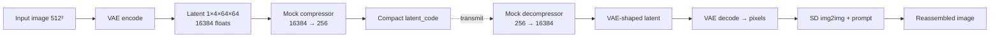

# MORPHOS

**Generative Compression Codec** — RedBot / IMAGE_8 workflow.

Ship a tiny latent vector; reassemble a high-fidelity image with a frozen diffusion prior.

> RedBot research scaffold. Extreme rate reduction via a learned (mock) bottleneck, then generative reconstruction.

Also in this repo: **[Morphogen v2](./morphogen-v2/)** — the living RD audiovisual instrument rebuilt **without WebGL** (CPU Gray–Scott + Canvas 2D). See [MORPHOS and Morphogen](./docs/MORPHOS-AND-MORPHOGEN.md) and the [red-team brief](./docs/morphogen-redteam/MASTER-BRIEF.md).

## Architecture (IMAGE_8)



1. **Encode** — Image → VAE latent `(1, 4, 64, 64)` → mock extreme compression → compact vector (default **256** floats ≈ 1 KB FP32).
2. **Transmit** — Compact numeric code (not an RD / residual-pattern bitstream).
3. **Decode** — Expand vector → VAE-shaped latent → VAE pixels → Stable Diffusion **img2img** (prompt-guided generative reassembly).

### Design notes

| Piece | Status | Notes |
|-------|--------|-------|
| SD 1.5 VAE + UNet | Real (pretrained) | Diffusers `runwayml/stable-diffusion-v1-5` |
| Compression / decompression MLPs | **Untrained mocks** | Shape demo only — train end-to-end in production |
| Decode path | VAE → img2img | Avoids incorrect `latents=` text2img shortcuts |
| Rate–distortion | Not optimized | No bitrate entropy coding yet |

## Quick start (codec)

```bash
python -m venv .venv && source .venv/bin/activate
pip install -r requirements.txt
python generative_codec.py --out-dir ./outputs
# or: ./scripts/run_demo.sh
```

GPU (`cuda`) is strongly preferred. CPU falls back to FP32 and will be slow. First run downloads model weights from Hugging Face.

### Shape-only tests (no model download)

```bash
pip install pytest torch torchvision Pillow requests
PYTHONPATH=. pytest tests/ -q
```

## Morphogen v2 (no WebGL)

```bash
cd morphogen-v2 && npm install && npm run dev
```

Open `http://127.0.0.1:5173` → ENTER → drag to seed colonies. `npm run check:nowebgl` must stay clean.

## CLI (codec)

| Flag | Default | Meaning |
|------|---------|---------|
| `--image` | HF sample URL | Local path or URL |
| `--prompt` | flower photo prompt | img2img guidance text |
| `--steps` | 30 | Diffusion steps |
| `--seed` | 42 | Reproducibility |
| `--out-dir` | `.` | Writes `original_input.png` + `generative_reassembled_output.png` |
| `--model-id` | `runwayml/stable-diffusion-v1-5` | Diffusers model |

## Known limitations

- Mock Linear nets mean **identity is not preserved**; outputs are generative / prompt-biased.
- Full encode→decode needs CUDA + multi-GB disk for weights — not suitable for GPU-less CI.
- Safety checker disabled in the demo pipeline for research friction; re-enable for product use.

## Project status

MORPHOS under RedBot ops. Daily commits refine architecture, docs, and eval harnesses.

## License

MIT — see [LICENSE](LICENSE).
